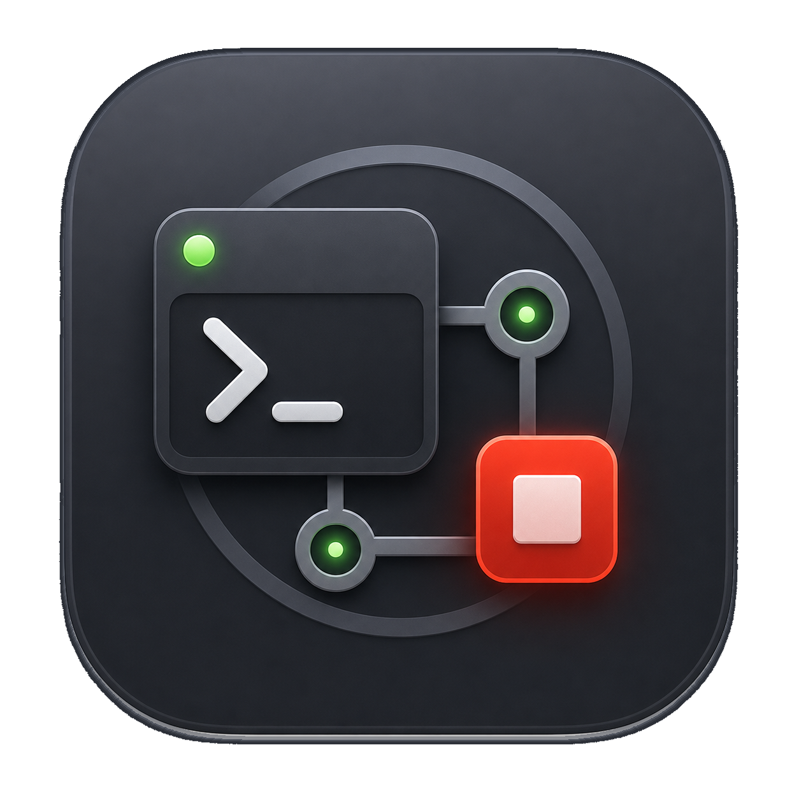
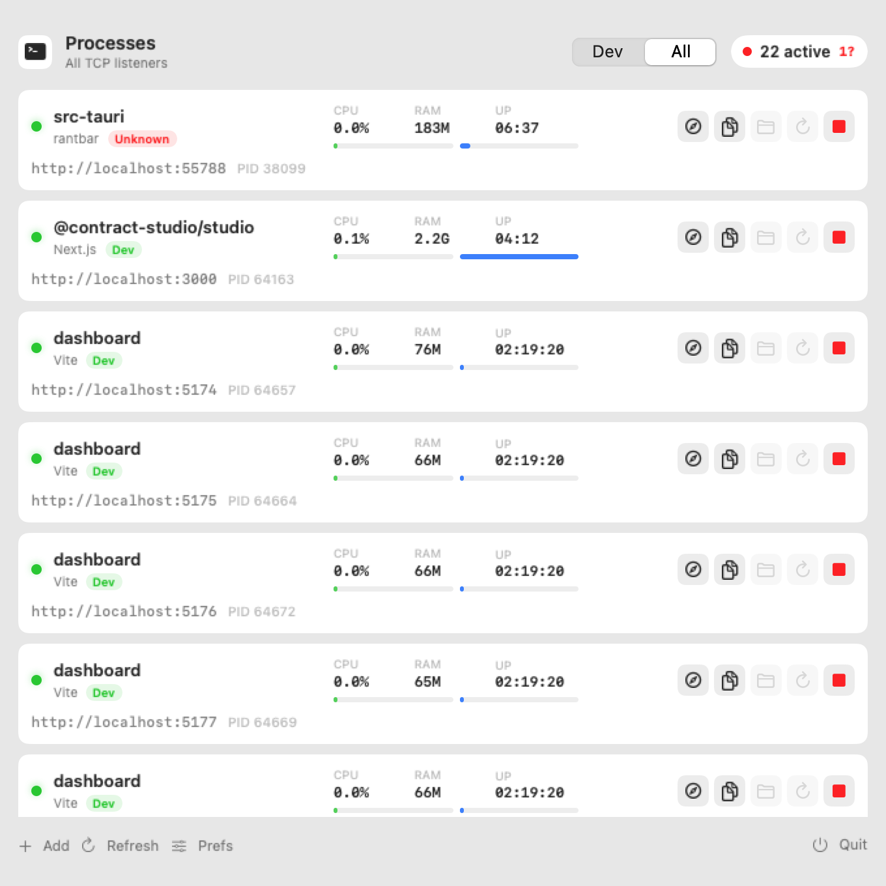
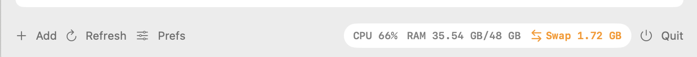

# PortsKiller

<p align="center">
  
</p>

<p align="center">
  <strong>A macOS menu bar app for inspecting and controlling local TCP listeners and development processes.</strong>
</p>

<p align="center">
  <a href="https://github.com/iddictive/PortsKiller/releases/latest"></a>
  
  
</p>

<p align="center">
  <a href="https://github.com/iddictive/PortsKiller/releases/latest"><strong>Download the latest release</strong></a>
  · <a href="#what-it-does">Features</a>
  · <a href="#build-from-source">Build</a>
  · <a href="#русский">Русский</a>
</p>

PortsKiller turns the usual `lsof`, `ps`, and “which process owns this port?” routine into a compact native interface. It shows local servers, ports, PIDs, commands, project folders, uptime, CPU, physical RAM, and swap, then gives you the actions that make sense for each process.

It is built for developers running Vite, Next.js, Astro, Nuxt, Node.js, npm, pnpm, yarn, bun, `tsx`, `nodemon`, MCP servers, iOS Simulators, Android Emulators, and other localhost tools.

<p align="center">
  
</p>

## What it does

- Finds TCP listeners and the processes using their ports on macOS.
- Separates likely JavaScript development servers from the complete listener list.
- Shows the process name, detected framework, localhost URL, port, PID, command, working directory, uptime, CPU, and memory usage.
- Opens or copies `http://localhost:<port>` and reveals the detected project folder in Finder.
- Stops eligible non-system process trees and restarts saved projects.
- Finds resource-heavy processes, iOS Simulator services, and Android Emulator processes even when they are not listening on a TCP port.
- Displays physical memory and swap separately. The menu bar can show CPU, RAM, or only the app icon; a small dot appears when swap is active.
- Saves runnable projects from a selected folder, detects npm, pnpm, yarn, or bun, and reads scripts from `package.json`.
- Captures stdout and stderr for processes started by PortsKiller during the current app session.
- Can launch at login and check, download, and install updates from GitHub Releases.

<p align="center">
  
</p>

## Interface

| Surface | Purpose |
| --- | --- |
| **Dev** | Likely JavaScript and local development listeners. |
| **Ports** | Every classified TCP listener found by the scanner. |
| **Activity** | Simulators, emulators, and other processes with notable CPU or memory use. |
| **Process row** | URL, PID, resource use, command context, and open, copy, reveal, restart, or stop actions. |
| **Add Project** | Selects a folder, reads package scripts, and saves a runnable working directory and command. |
| **Preferences** | Configures launch at login, the menu bar metric, saved projects, and software updates. |

## How it works

PortsKiller scans listening TCP sockets with the macOS `lsof` command and enriches each listener with process data from `ps`, Mach APIs, and the process tree. Dev mode applies heuristic classification, so use Ports mode when you need the complete listener inventory.

When you add a project, PortsKiller reads its `package.json` and lockfile, suggests an available script and port, and stores the resulting `cwd + command`. Start and restart actions run that command with `zsh`; the required runtime and package manager must already be available on your Mac.

Stop actions are intentionally limited to eligible non-system processes. Simulator actions also validate the current process identity before terminating a process tree.

## Install

Download the current DMG or ZIP from [GitHub Releases](https://github.com/iddictive/PortsKiller/releases/latest), move PortsKiller to Applications, and launch it. The launch-at-login toggle is available when the app runs from a packaged `.app` bundle.

PortsKiller requires macOS 13 or newer. The repository packaging script does not notarize builds, so macOS can ask you to confirm the first launch.

## Build from source

Requirements:

- macOS 13 or newer
- Xcode Command Line Tools
- Swift 6 toolchain

Build and test the Swift package:

```bash
swift build
swift test
```

Create a runnable app bundle and versioned DMG:

```bash
scripts/build-app.sh
open -n .build/PortsKiller.app
```

The packaging script creates `.build/PortsKiller.app` and `.build/PortsKiller-<version>.dmg` with an ad-hoc code signature.

## Command-line diagnostics

The packaged executable also supports focused scanner output without opening the menu bar interface:

```bash
.build/debug/PortsKiller --scan-once
.build/debug/PortsKiller --scan-all
.build/debug/PortsKiller --scan-activity
.build/debug/PortsKiller --system-stats
```

These commands are useful when checking which local process is using a port, comparing Dev and Ports detection, or inspecting total CPU, physical memory, and swap usage.

---

<a id="русский"></a>

## Русский

PortsKiller — нативное приложение для строки меню macOS, которое показывает локальные TCP-порты и процессы разработчика и позволяет управлять ими без постоянной работы с `lsof`, `ps` и Activity Monitor.

Приложение показывает порт, PID, localhost URL, команду, рабочую папку, uptime, CPU, физическую RAM и swap. Можно открыть или скопировать URL, показать папку в Finder, остановить подходящий процесс или перезапустить сохранённый проект.

Три режима помогают разделить задачи:

- **Dev** — вероятные JavaScript-серверы и инструменты локальной разработки;
- **Ports** — полный список найденных TCP listeners;
- **Activity** — симуляторы, эмуляторы и тяжёлые процессы без привязки к порту.

Проект добавляется через выбор папки: PortsKiller читает `package.json`, определяет npm, pnpm, yarn или bun и предлагает доступные scripts. Для процессов, запущенных самим приложением, доступны логи текущей сессии.

В строке меню можно оставить CPU, RAM или только иконку. Физическая память и swap показываются отдельно, а небольшая точка появляется только при активном swap.

Скачать готовую сборку: [GitHub Releases](https://github.com/iddictive/PortsKiller/releases/latest).
