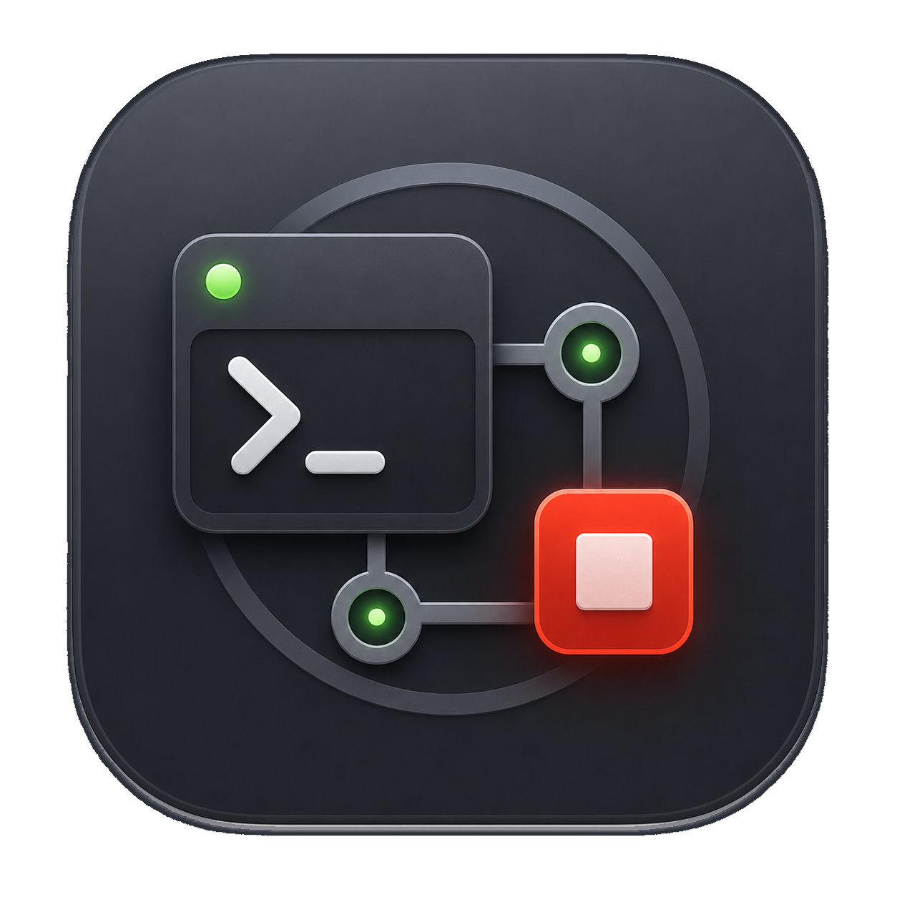
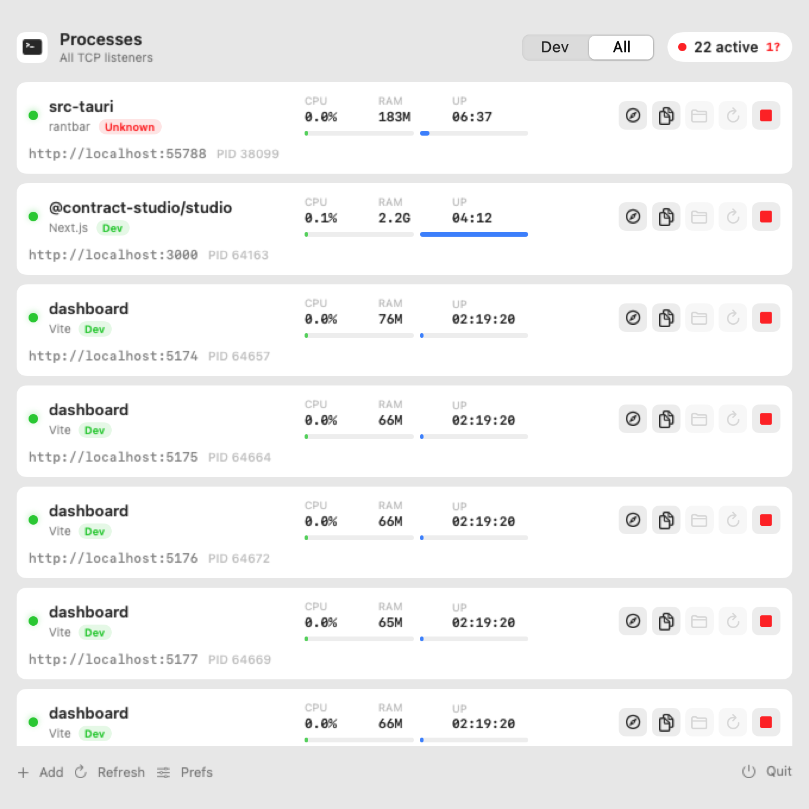
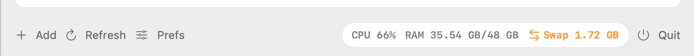

<p align="center">
  
</p>

<h1 align="center">PortsKiller</h1>

<p align="center">Find what owns a port. Inspect, stop, and restart local development processes from the macOS menu bar.</p>

<p align="center">
  <a href="https://github.com/iddictive/PortsKiller/releases/latest">Download for macOS</a> ·
  <a href="#what-it-does">Features</a> ·
  <a href="#build-from-source">Build from source</a> ·
  <a href="#русский">Русский</a>
</p>

<p align="center">
  <a href="https://github.com/iddictive/PortsKiller/releases/latest"></a>
  
</p>

PortsKiller brings local servers and process controls into one native window. Use **Dev** for likely development servers, **Ports** for the full TCP listener list, or **Activity** for resource-heavy processes, simulators, and emulators.

<p align="center">
  
</p>

## Quick start

1. Download the DMG from [Releases](https://github.com/iddictive/PortsKiller/releases/latest).
2. Move PortsKiller to Applications and launch it.
3. Open the menu bar app and select **Dev**, **Ports**, or **Activity**.
4. To save a runnable project, choose **Add Project**, select its folder, and choose its launch command.

Requires macOS 13 or newer. Release builds are ad-hoc signed and are not notarized; macOS may require first-launch confirmation.

## What it does

- **Find the listener.** Switch between development servers, all TCP listeners, and resource-heavy activity.
- **Inspect the process.** See its port, PID, command, project folder, uptime, CPU, physical RAM, and swap.
- **Act from the same window.** Open localhost, reveal the folder, stop an eligible process tree, or restart a saved project.
- **Save a project once.** Select its folder and a package script; PortsKiller detects npm, pnpm, yarn, or bun.
- **Read session logs.** Inspect stdout and stderr for processes launched by PortsKiller.
- **Watch resources.** Put CPU or RAM in the menu bar and inspect simulator and emulator activity.

<p align="center">
  
</p>

## How it works

PortsKiller scans listening TCP sockets with the macOS `lsof` command and enriches each listener with process data from `ps`, Mach APIs, and the process tree. Dev mode applies heuristic classification, so use Ports mode when you need the complete listener inventory.

When you add a project, PortsKiller reads its `package.json` and lockfile, suggests an available script and port, and stores the resulting `cwd + command`. Start and restart actions run that command with `zsh`; the required runtime and package manager must already be available on your Mac.

Stop actions are intentionally limited to eligible non-system processes. Simulator actions also validate the current process identity before terminating a process tree.

Restart is available for saved projects and detected launch commands. When the command cannot be inferred, the setup button opens Add Project with the process folder and port filled in; enter its launch command to enable restart. Session recovery is currently disabled behind a feature flag.

Preferences group general settings, software updates, and saved projects. Update dialogs show release notes from the release or its tagged changelog. Automatic checks and downloads are configurable; installation still asks for confirmation. Updates run only from `/Applications/PortsKiller.app`, verify the staged bundle identity, signature integrity, and version, then back up the current app and roll back if launch fails. Builds use ad-hoc signing, not Developer ID authentication or notarization.

## Build from source

Requirements:

- macOS 13 or newer
- Xcode Command Line Tools
- Swift 6 toolchain

Build and test the Swift package:

```bash
swift build
swift test
```

Create a runnable app bundle and versioned DMG:

```bash
scripts/build-app.sh
open -n .build/PortsKiller.app
```

The packaging script creates `.build/PortsKiller.app` and `.build/PortsKiller-<version>.dmg` with an ad-hoc code signature.

The release workflow builds and publishes a DMG on pushes to `main`, version tags, or manual dispatch. `scripts/version.sh` owns version selection: normal branch releases increment the minor version from the latest tag. Set `PORTSKILLER_VERSION` for an explicit local package version. See [CHANGELOG.md](CHANGELOG.md) for release changes.

## Command-line diagnostics

The packaged executable also supports focused scanner output without opening the menu bar interface:

```bash
.build/debug/PortsKiller --scan-once
.build/debug/PortsKiller --scan-all
.build/debug/PortsKiller --scan-activity
.build/debug/PortsKiller --system-stats
```

These commands are useful when checking which local process is using a port, comparing Dev and Ports detection, or inspecting total CPU, physical memory, and swap usage.

---

<a id="русский"></a>

## Русский

PortsKiller — нативное приложение для строки меню macOS, которое показывает локальные TCP-порты и процессы разработчика и позволяет управлять ими без постоянной работы с `lsof`, `ps` и Activity Monitor.

Приложение показывает порт, PID, localhost URL, команду, рабочую папку, uptime, CPU, физическую RAM и swap. Можно открыть или скопировать URL, показать папку в Finder, остановить подходящий процесс или перезапустить сохранённый проект.

Три режима помогают разделить задачи:

- **Dev** — вероятные JavaScript-серверы и инструменты локальной разработки;
- **Ports** — полный список найденных TCP listeners;
- **Activity** — симуляторы, эмуляторы и тяжёлые процессы без привязки к порту.

Проект добавляется через выбор папки: PortsKiller читает `package.json`, определяет npm, pnpm, yarn или bun и предлагает доступные scripts. Для процессов, запущенных самим приложением, доступны логи текущей сессии.

В строке меню можно оставить CPU, RAM или только иконку. Физическая память и swap показываются отдельно, а небольшая точка появляется только при активном swap.

Основное окно можно растягивать за края; размер сохраняется. Действия доступны прямо в карточке процесса. Если команда перезапуска неизвестна, кнопка настройки открывает добавление проекта. Автообновление установленной копии показывает изменения релиза, проверяет загруженное приложение и восстанавливает предыдущую версию при неудачном запуске. Session recovery отключён.

Скачать готовую сборку: [GitHub Releases](https://github.com/iddictive/PortsKiller/releases/latest).
